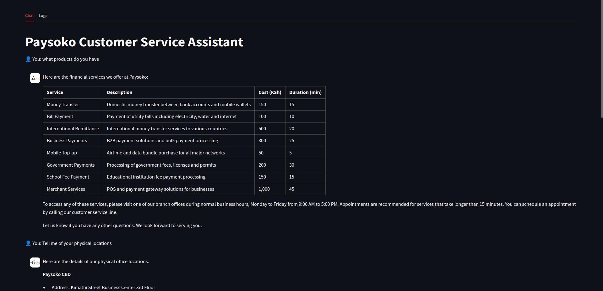

# Data Processing

## Generated Dataset

I've created four interconnected CSV files for Paysoko, this dataset was generated using AI. It is a synthetic dataset.


### services.csv - Contains details about

Different payment services offered
Service descriptions
Costs in Kenyan Shillings
Estimated duration of each service


### office_locations.csv - Lists

All office locations across Nairobi
Complete addresses
Contact numbers
Unique office identifiers


### office_hours.csv - Shows

Operating hours for each location
Different timings for weekdays and weekends
Closed days


### appointments.csv - Tracks

Customer appointments
Selected services
Chosen locations
Appointment status (Confirmed/Pending/Cancelled)

The data uses consistent IDs across files (office_id, service_id) to maintain relationships between the different datasets. All prices are in Kenyan Shillings (KSH) and times are in 24-hour format.

## Load Dataset Into Neo4j Database

### Load Offices Into Neo4j Database

I started office with the offices location as it has no foreign keys needed.


There are mainly five offices:

1. Paysoko Eastleigh
2. Paysoko Westlands
3. Paysoko CBD
4. Paysoko Kasarani
5. Paysoko Karen


### Load Office Operation Hours Operation Dataset

We can now move on to loading the office dataset since we already have the office records in the graph database.

**NOTE:**

We are working with the assumption that all offices have the same operating hours as they are all located within Nairobi. This could not be the case if we have offices located in different countries.


### Load The Services Data

For the services data, we do not have any foreign keys to worry about so loading it is a simple straight forward approach.


### Load Appointments Data

The appointment dataset has some foreign keys, we have already inserted these keys into our knowledge graph so we are ready to go.


## Generative AI Chatbot

For the generative AI customer support chatbot, we'll implement a GraphRAG application. Here is an overview:


### Requirements

All the requirements can be found in the `requirements.txt` file.


### Mapping Values

In this section, we'll explore strategies for enhancing graph database query generation by effectively mapping values from user inputs to the database. While the built-in graph chains enable LLMs to understand the graph schema, they don't provide insight into the actual property values stored within the database.

To address this limitation, we can implement an additional step in the graph database QA system that focuses specifically on accurate value mapping. This new step will help bridge the gap between user inputs and the database's actual content, leading to more precise and relevant query results.


#### Creating Fulltext Searches

This is to help in the mapping of user input queries to database input queries.

Here is the Cypher code to create the fulltext indexes

```cypher
// Create fulltext index for office locations
CREATE FULLTEXT INDEX locationIndex FOR (n:OfficeLocation) 
ON EACH [n.location_name, n.address, n.region];

// Create fulltext index for services
CREATE FULLTEXT INDEX serviceIndex FOR (n:Services)
ON EACH [n.service_name, n.description];

// Create fulltext index for appointments
CREATE FULLTEXT INDEX appointmentIndex FOR (n:Appointment)
ON EACH [n.appointment_id, n.customer_id];

// Create fulltext index for office hours
CREATE FULLTEXT INDEX officeHours FOR (o:OfficeHour)
ON EACH [o.day_of_week, o.opening_time, o.closing_time];
```

You can view the created indexes using:

```cypher
SHOW INDEXES;   
```

Drop indexes if needed:

```cypher
DROP INDEX locationIndex;
DROP INDEX serviceIndex;
DROP INDEX appointmentIndex;
```

### Cypher Generation

Once we are able to extract the information mapping, we need to pass the results of the mapping process back to the agent along side the user query and the schema. This will be used to generate a more accurate cypher code.

To achieve this, we'll leverage the LangChain expression language, which provides powerful tools for building these complex prompts. The LangChain expression language will help us integrate these different components seamlessly and generate effective Cypher queries.

### Generating Natural Language Response Based On Results Of Executing The Generated Cypher

Finally we can go ahead and answer the users query. This is first done by executing the generated Cypher code and getting the output. This output along side the user questions is passed to an LLM to generate and answer the user questions in a natural language format.


### Q&A Logger

This is just a simple logging feature that will keep track of all the questions that users ask the bot. Question, Response and Time will be tracked.


### Command To Start FastAPI Application

To start the Fast api application, navigate to the directory `v1` and fun the following commands:


```terminal
$ poetry run uvicorn main:app --reload
```

Navigat to [http://127.0.0.1:8000/docs](http://127.0.0.1:8000/docs) in your browser and you should be able to access the swagger UI.


### Command To Start Gradio App

For the gradio UI application, you can run it by navigating into the `standalone_gradio_app` and run the following command:

```terminal
$ poetry run python3 app.py
```


### Command To Start The Streamlit Application

To start the streamlit app, run the following command once have navigated into the `standalone_streamlit_app` directory.

```terminal
poetry run streamlit run app.py
```

The application should look like




